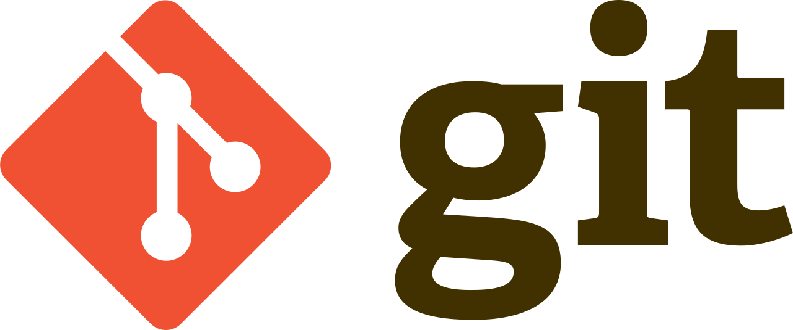
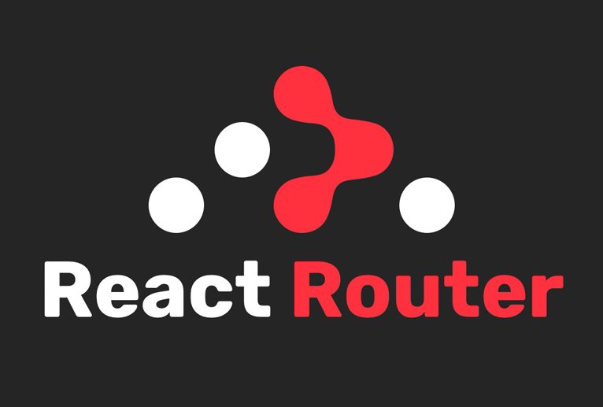
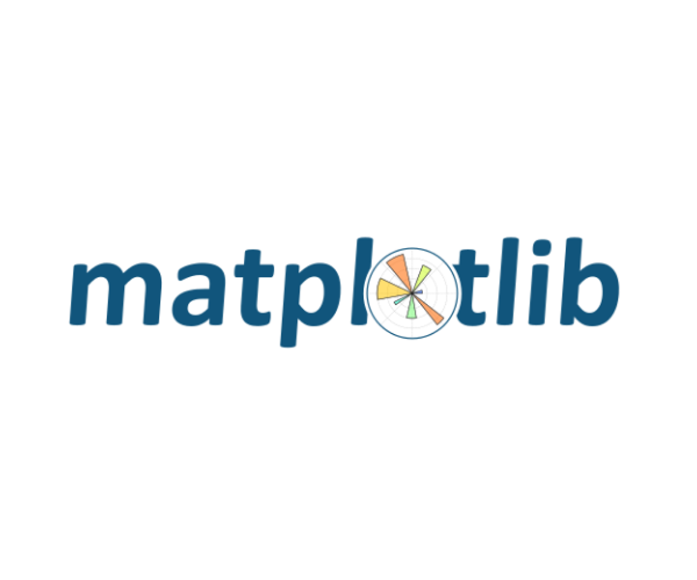
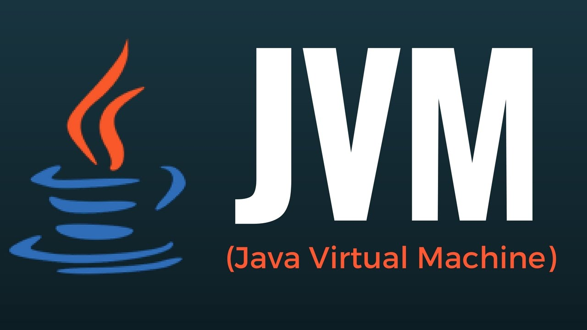

# 서울 5반 A503

# 소개 영상

https://youtu.be/pkf5tdeBogI

# 프로젝트 진행 기간

2023.02.20 - 2023.04.07 - 약 7주

# 프로젝트 소개

컨텐츠 기반 추천을 통해 나만의 1면!!!

# 메인기능

- 뉴스 추천 기능을 활용한 나만의 신문 1면을 보여준다.
- 유저 스크랩 북 관리 기능

# 세부사항

- 컨텐츠 기반 뉴스 추천
- 품질 평가를 통과한 기사만 노출
- 편리한 스크랩 북 관리, 헤드라인 제목과 시간 순으로 정렬하는 기능 등 유저 경험 개선

# 시스템 구성

![noPicture][./system archi.png]

# 기술 스택

## 공통

이슈 관리 : Jira

형상 관리 : Git

협동 툴 : Mattermost, Webex, Notion

Server : AWS EC2 `Ubuntu 20.04 LTS`
<br/>




## FE

기술 스택(버전) : React `18.2.0`, React-router-dom `6.9.0`, axios `1.3.4`, recoil `0.7.7`

사용 툴 : visual studio





## C. BE

### i. WAS (Web Application Server)

기술 스택(버전) : openjdk `11`, Spring boot `2.7.9`, OAuth2, Kakao,

사용 툴 : IntelliJ


### ii. CRS (Contents Recommendation Server)

기술 스택(버전) : Python3 `3.9.2`, fastapi `0.95.0`, uvicorn `0.21.1`, SQLAlchemy `2.0.8`, PyMySQL `1.0.3`, numpy `1.24.2`, gensim `4.3.1`, pytest `7.1.2`
사용 툴 : PyCharm `2022.3.2`


### iii. 공통

기술 스택(버전) : Nginx `1.18.0`, Jenkins, Docker `23.0.1`

사용 툴 : Mobaxterm


## D. DATA

### i. 크롤링

기술 스택(버전) : Python3 `3.9.2`


, MongoDB `4.2`, Crontab, Sehll Script
사용 툴 : PyCharm `2022.3.2`, Mobaxterm

### ii. 빅데이터 추천 모델

기술 스택(버전) : Python `3.9` , Numpy `1.24`, Pandas `1.5`, konlpy `0.6`, gensim `4.3.1`, seaborn `0.12`, matplotlib `3.7`, pyLDAvis `3.4` , MongoDB `4.2`
사용 툴 : JupyterNotebook `5.3` , MongoDB, JVM







# Git Convention

## 🖤 브랜치 컨벤션

```markdown
- Branch 종류

  - main
    - 배포 가능한 상태의 결과물
  - develop
    - 구현한 기능을 병합하기 위한 브랜치
    - 통합 폴더의 기능
  - feature

    - 개별 기능 구현 브랜치
    - 기능 개발 완료 시 삭제
    - 네이밍 규칙

      - feature/파트/서비스
      - feature/fe/로그인
      - feature/be/로그인
      - feature/data/naver-news-crawling
```

## 🖤 커밋 메시지 컨벤션

<aside>
✅

### 1. 커밋 유형 지정

- 커밋 유형은 영어 대문자로 작성하기
  | 커밋 유형 | 의미 |
  | ---------------- | ------------------------------------------------------------ |
  | Feat | 새로운 기능 추가 |
  | Fix | 버그 수정 |
  | Docs | 문서 수정 |
  | Style | 코드 formatting, 세미콜론 누락, 코드 자체의 변경이 없는 경우 |
  | Refactor | 코드 리팩토링 |
  | Test | 테스트 코드, 리팩토링 테스트 코드 추가 |
  | Chore | 패키지 매니저 수정, 그 외 기타 수정 ex) .gitignore |
  | Design | CSS 등 사용자 UI 디자인 변경 |
  | Comment | 필요한 주석 추가 및 변경 |
  | Rename | 파일 또는 폴더 명을 수정하거나 옮기는 작업만인 경우 |
  | Remove | 파일을 삭제하는 작업만 수행한 경우 |
  | !BREAKING CHANGE | 커다란 API 변경의 경우 |
  | !HOTFIX | 급하게 치명적인 버그를 고쳐야 하는 경우 |
  ### ex)Feat:주요 변경 내용

### 2. 제목과 본문을 빈 행으로 분리

- 커밋 유형 이후 제목과 본문은 한글로 작성하여 내용이 잘 전달될 수 있도록 할 것
- 본문에는 변경한 내용과 이유 설명 (어떻게 보다는 무엇 & 왜를 설명)

### 3. 제목 첫 글자는 대문자로, 끝에는 `.` 금지

### 4. 제목은 한국어 기준 50자 이내로 할 것

```
Feat : 주요 변경 내용
- 변경 내용 1
- 변경 내용 2
- 변경 내용 3
```

</aside>

### 🖤 규칙에 맞는 좋은 커밋 메시지를 작성해야 하는 이유

- 팀원과의 소통
- 편리하게 과거 추적 가능
- 나중에 실무에서 익숙해지기 위해

### 🖤 한 커밋에는 한 가지 문제만!

- 추적 가능하게 유지해주기
- 너무 많은 문제를 한 커밋에 담으면 추적하기 어렵다.

## 🖤 MR 컨벤션

### 반영 브랜치

ex) feat/login -> dev

### 변경 사항

ex) 로그인 시, 구글 소셜 로그인 기능을 추가했습니다.

### 테스트 결과

ex) 베이스 브랜치에 포함되기 위한 코드는 모두 정상적으로 동작해야 합니다. 결과물에 대한 스크린샷, GIF, 혹은 라이브 데모가 가능하도록 샘플API를 첨부할 수도 있습니다.
